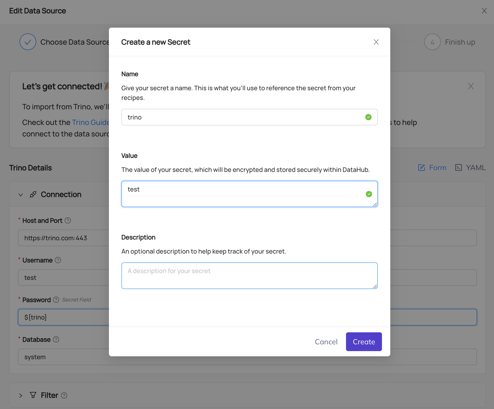

# Datahub <-> Trino TLS/HTTPS

## 파일

- `values.yaml` - [helm chart](https://artifacthub.io/packages/helm/trino/trino/1.37.0)
- `docker-compose.yml` -
  [datahub github](https://github.com/datahub-project/datahub/blob/v1.0.0rc6/docker/quickstart/docker-compose-without-neo4j-m1.quickstart.yml)

## 준비

- `/etc/trino_volume/clustercoord.pem` 경로에 [폴더 및 pem 파일 생성](https://trino.io/docs/current/security/inspect-pem.html#inspect-pem-file)
- helm 차트 배포 -> k8s 클러스터에 tls 인증서 생성 -> ingress로 도메인 주소 연동 [예시](./ingress.yaml)
- docker-compose.yml 실행

## Datahub Trino Recipe

```yaml
source:
    type: trino
    config:
        host_port: "${HTTPS URL}:443"
        database: ${TRINO CATALOG}
        username: ${USER}
        include_views: true
        include_tables: true
        profiling:
        enabled: true
        profile_table_level_only: true
        stateful_ingestion:
        enabled: true
        password: "${PASSWORD}" # password secret을 만들면 자동으로 ${secret name} 형태로 생성됨
```

---

## 예시

- Trino Cluster URL - https://trino.com
- Trino User - test
- Trino Password - test


